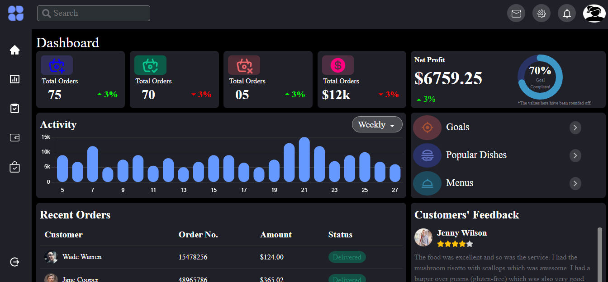

# 🎨 Fitpeo Dashboard

This project demonstrates a variety of UI components styled with custom CSS modules. It includes components such as Header, Sidebar, Dashboard, Feedback, and others, each designed with a focus on responsiveness and modern styling practices.

## 🌐 Deployment

[Fitpeo Dashboard](https://66b1ce19858dfd9aa036984f--verdant-piroshki-54c050.netlify.app)

## 📸 Snapshots

- **Home Page**



## 🛠️ Installation

To run this project locally, follow these steps:

1. Clone the repository.
2. Navigate to the project directory.
3. Install the necessary dependencies:

```
npm install
```

4. Run the project.

```
npm start
```

5. The app will start running on http://localhost:3000.

## 🏗 Component Styling

### Header

Utilizes Bootstrap for responsive navigation. Custom styles are applied to the search bar, navigation items, and profile image.

### Sidebar

Styled to maintain a fixed position on the left side of the screen with a logo and navigation icons.

### Dashboard

Uses a grid layout with a left and right container for different sections (e.g., Statistics, Orders).

### Feedback

Displays customer feedback in a table format with avatars, names, ratings, and review text.

### Options

Presents options with icons and titles in a card format.

### Orders

Uses a table to list recent orders with columns for customer, order number, amount, and status.

### Profit

Displays a circular progress bar for profit tracking along with text indicating progress.

### Circular Progress Bar

Shows progress with a circular bar and percentage text.

### Activity

The component uses the ActivityChart to display data visually using react-chartjs-2.

## 💡 Technologies Used

- **React**
- **CSS Modules**
- **React Icons**
- **React Circular Progressbar**
- **React-chartjs-2**
- **Bootstrap**

## 👩‍💻 Authors

- [@Snehal](https://github.com/Snehal-Salvi)
